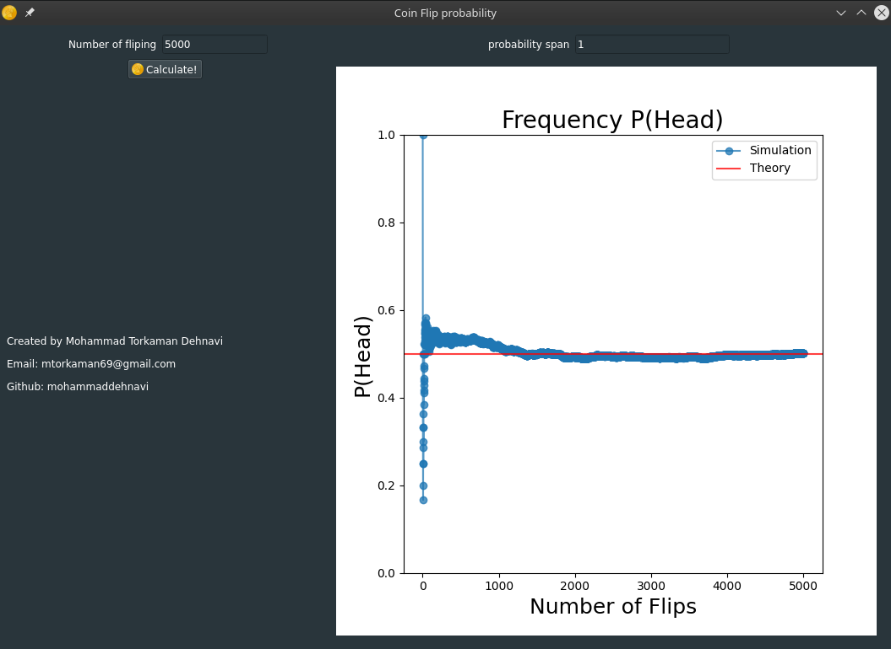
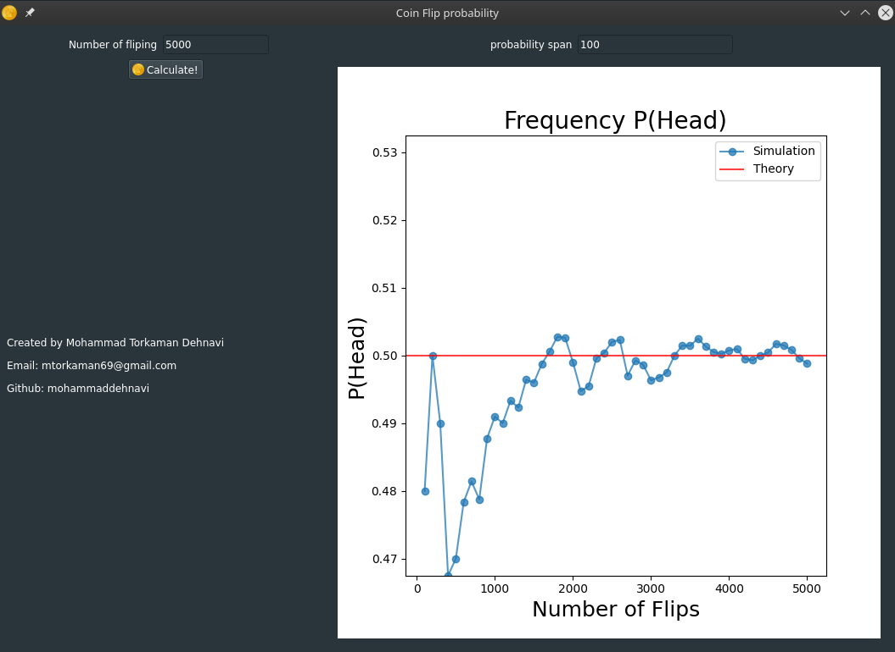
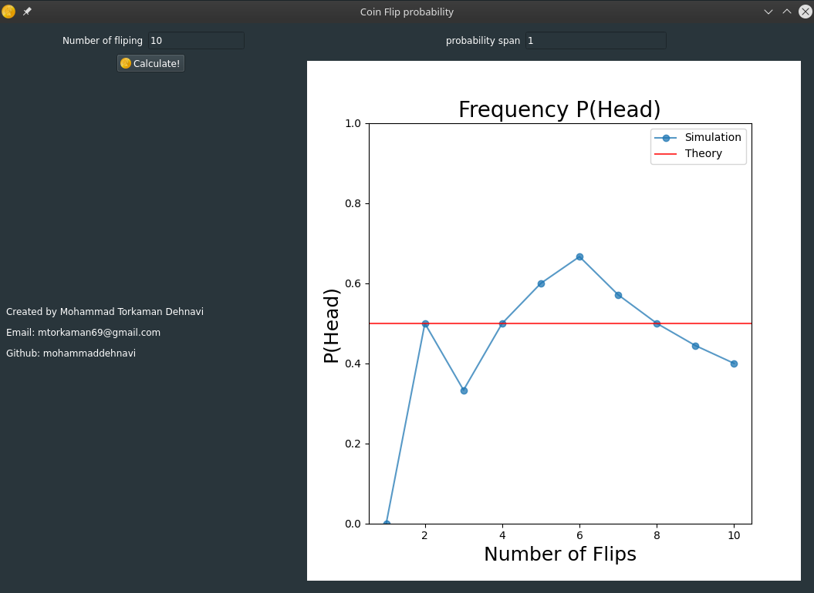

# Python3 GUI app for calculate coin flip probability

## Clone project

```bash
git clone https://github.com/mohammaddehnavi/coin-flip-probability.git
cd coin-flip-probability
```
## Install virtual env 

```bash
pip3 install virtualenv
python3 -m venv env-coin-flip-probability
source env-coin-flip-probability/bin/activate
```

## Install requirements

```bash
## Upgrade your pip
pip install --upgrade pip

## install packages
pip install -r requirements.txt
```

## RUN

```bash
python3 main.py
```

## Change GUI

If you want to change the GUI file please use QT Designer and open `coin.ui` and edit it and then create
your python file with `pyuic5 -x coin.ui -o yourMain.py`


## Create executable file 

I use `auto-py-to-exe` to compile this project to a single executable file. [Link!](https://pypi.org/project/auto-py-to-exe/)

```bash
## install auto-py-to-exe
pip install auto-py-to-exe

## Run auto-py-to-exe for compile and build 
auto-py-to-exe
```

## Application pics



